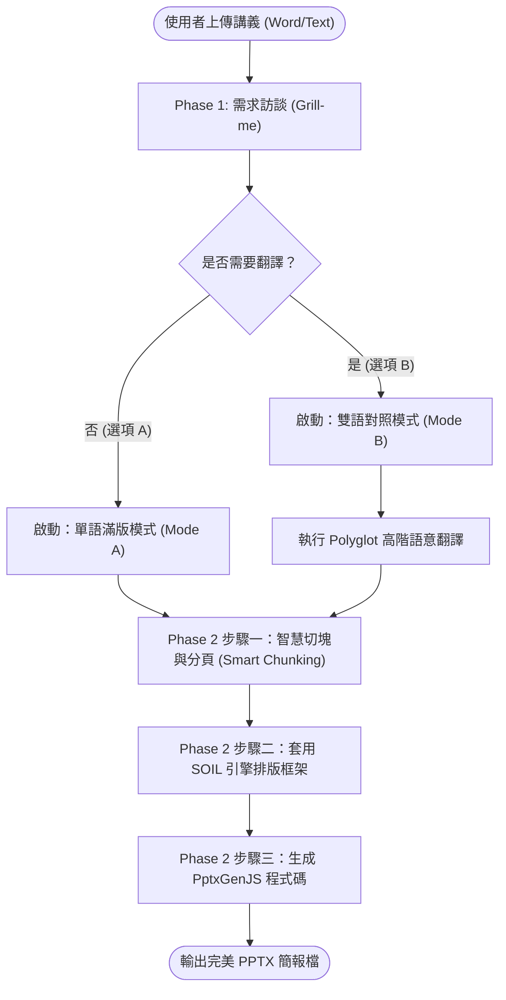
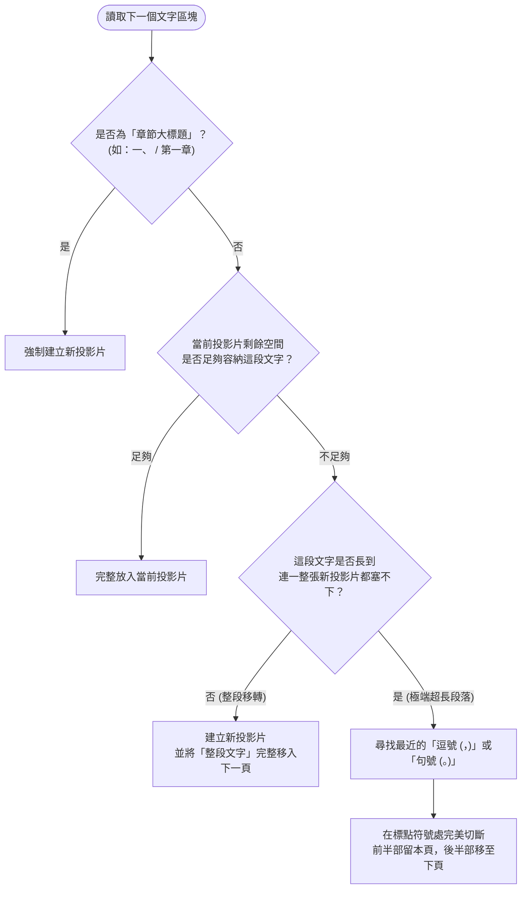
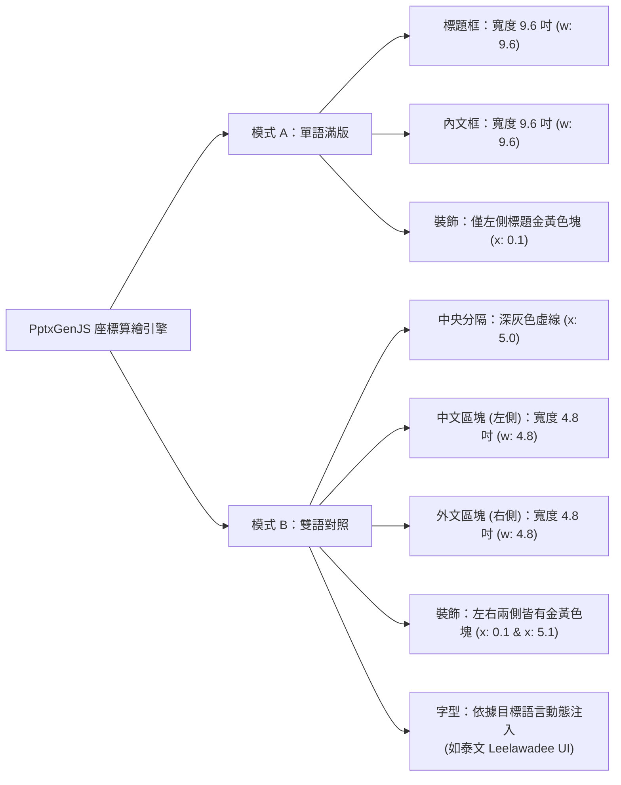

# 📽️ Bilingual SOIL Deck 全系統架構與流程圖

這份文件記錄了我們為「多語系宗教/哲學講義轉簡報」所打造的自動化系統架構。本系統整合了翻譯、智慧分頁與自動排版寫碼三大引擎。

## 1. 🌟 全系統核心工作流 (Overall Pipeline)
這是系統從接收使用者的 Word 講義，到最終產出 PPTX 的完整路徑。系統會根據使用者在 Phase 1 的選擇，自動分流到「單語」或「雙語」的處理管線。

---

## 2. ✂️ 智慧切塊與分頁演算法 (Smart Chunking Logic)
這是解決「文字全擠在一頁」與「一句話被腰斬」痛點的核心邏輯。AI 在處理文字時，會嚴格按照此決策樹進行分頁判定。

---

## 3. 📐 PptxGenJS 版面渲染引擎 (UI/UX Layout Engine)
當進入程式碼生成階段時，引擎會根據模式（Mode A 或 Mode B）精準分配投影片的 10 吋寬度與 5.625 吋高度，達到「0 間距、極致滿版、無縫貼合」的視覺效果。

